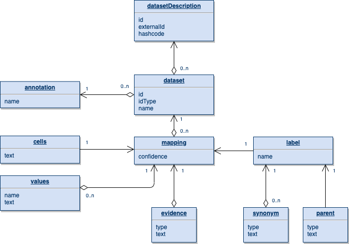

# CAP Data Model

## Assumptions and Aims
There are some basic architectural assumptions that we make:

1. CAP is focused on persisting the mapping between cells and annotation terms (labels). Associated metadata will also be recorded. This is in contrast to recording recipes, models, etc.
2. Annotations will be dynamic, contributed and modified by different users and user groups.
3. There will be multiple potential annotations per dataset, and some annotations will span multiple datasets.

In designing CAP and data structure in particular, there are some specific aims that we would like to achieve:

1. CAP data model should be suitable for both simplest use cases (e.g. a postdoc quickly trying to make sense of their new experiment for their own purposes) as well as complex ones (e.g. Allen Brain Institute is preparing a release of human brain annotation).
2. CAP should encourage, but not mandate input of more detailed and more normalized information.
3. CAP should keep track of versions, users, groups in a way similar to a version control system. Serve citable accession numbers. 
4. CAP should be usable through both rich UIs as well as programmatic access.

## Data Model
The proposed data model is presented as a document structure within a version control repository. This can be easily translated into a relational or object database model. The model is presented in steps, starting with the simplest element, building up to the entire structure.

Below is a minimal annotation data block, that associates a simple text label with a list of cells in a single dataset:
```{xml}
<dataset id='InternalDatasetId'>
  <mapping>
    <label name='T cell'/>
    <cells>"Cell1", "Cell2", "Cell3"<cell/>
  </mapping>
</dataset>
```

The example above is minimal. There is quite a bit of additional information that we would like to get, and while the UIs will encourage such input, more detailed elements described below will be essentially optional (or set to default values).

### Annotation element
The annotation itself records an action of assigning a label to some data feature. By default it will be a subpopulation. Down the road, however, we will need to accommodate annotations of other features, such as gradients or trajectories. For the sake of future compatibility, it may be best to keep the entities on the biological rather than technical side. So the proposed annotation types are: `type|state|process`:
```{xml}
<mapping type='state'> <label name='S phase'/> ... </mapping>
```

### Label element
Labels will have synonyms, including official IDs (e.g. ontology term ID), as well as relationships between each other. We would like to capture this information whenever possible.
```{xml}
<label name='T cell'>
  <synonym name='T lymphocyte'/>
  <synonym name='http://purl.obolibrary.org/obo/CL_0000084' type='CO ID'/>
  <parent name='lymphocyte'/>
</label>
```

### Cell assignment element
The association of the cells with the label may have qualifiers, such as confidence of assignment. If this is provided (likely by automated methods), we would like to record it:
```{xml}
<mapping>
  <label name='T cell'/>
  <cells>"Cell1", "Cell2", "Cell3"<cell/>
  <values name='confidence'>0.95,0.3,0.7</values>
</mapping>
```

It may also be useful to introduce an overall confidence element for the entire annotation - which some of the users may choose to provide manually:
```{xml}
<mapping>
  <label name='T cell'/>
  <cells>"Cell1", "Cell2", "Cell3"<cell/>
  <confidence>0.5</confidence>
  <evidence>'Jack said it looks like a T cell'</evidence>
</mapping>
```

In the case of pseudotime or gradient annotation, the position of the cells within the pseudotime can also be captured by such mapping value property (in that case, it will be a required property). In this case, the `confidence` mapping can be used to represent the distance or strength of association of the cell with a given pseudotime point:
```{xml}
<mapping type='process'>
  <label name='T cell activation'/>
  <cells>"Cell1", "Cell2", "Cell3"<cell/>
  <values name='pseudotime'>0, 0.3, 1.0</values>
  <values name='confidence'>0.9,0.8,0.3</values> <!-- interpreted as distance -->
</mapping>
```

### Evidence
If provided, we would like to keep track of the basis for why the label was assigned. It is hard to envision a simple structure that would capture a potentially diverse set of structured and verbal explanations. At the base level, the investigator should be able to provide some text. It will be mostly useful to them, but we can probably mine gene IDs from it, and perhaps even some relationships and publications. We can add specific evidence types, such a reference to a publication, marker genes, etc. but I suspect we will only be able to get such detailed info in a handful of cases.
```{xml}
<mapping>
  <label name='T cell'/>
  <cells>"Cell1", "Cell2", "Cell3"<cell/>
  <evidence type='freetext'>Express TRAC</evidence> <!-- default type -->
  <evidence type='reference'>PMID:315070</evidence>
  <evidence type='markers'>CD3D+, CD3E+, CD19-</evidence> <!-- break up into two lists?  -->
</mapping>
```


In addition to detailed evidence, we should keep track of the basic method by which annotation was achieved. By default, it is manual. Moving forward, we will see more and more algorithmic or automated annotations, and should capture name/parameters of such methods:
```{xml}
<mapping>
  <label name='CD8+ T cell'/>
  <cells>"Cell1", "Cell2", "Cell3"<cell/>
  <method name='CellAnnotatoR'>
    <parameter name='version' text='1.1'>
    <parameter name='model'>https://cole-trapnell-lab.org/immune.model</parameter>
  </method>
</mapping>
```

It may also be useful to collect other information about the tool that the investigator is using, or the view that they're looking at when annotating. However, this type of instance information appears to be very optional and does not lend itself well to repeated editing by multiple individuals.

### Dataset descriptors
CAP will not be a dataset repository, but it will need to keep track of datasets to:

1. Load and persist annotations available for a given dataset
2. Find molecular data (for different uses, such as suggestions, ratings, CellCards displays, etc.)

Given that the basic edge use case is a researcher annotating their own private dataset, CAP will need to assign internal IDs to the datasets. Hopefully in most cases these will be clearly mapped to IDs in DCP or other public repos. In specifying annotations, it may be acceptable to specify different ID types other than internal IDs:
```{xml}
<dataset id='6092f4b2-0b27-43fa-a4cd-2fadad57315f' idType='DCP-UUID'>
  ...
</dataset>
```

Whenever a new dataset is 'registered', somewhere in the database a more detailed description should be generated:
```{xml}
<datasetDescription id='internalDatasetId1' name='my favorite dataset'>
  <externalId type='DCP-UUID' text='6092f4b2-0b27-43fa-a4cd-2fadad57315f'>
  <hashcode>437b930db84b8079c2dd804a71936b5f</hashcode>
</datasetDescription>
```
- In the example above, the name is the human-readable name of the dataset, which can be re-defined for the purposes of the current annotation. The ID attribute would be a generated CAP internal id.
- The hashcodes will be automatically generated robust fingerprints to recognize private (unregistered) datasets being annotated by different users.

## Overall structure and version control
We need to identify a granularity of annotation information that will be managed in a coordinated manner. This level will be suitable for citable accession numbers (and, I argue, should bear the critical `annotation` element name). The proposal is that a citable annotation may include annotations for one or more datasets:

```{xml}
<annotation name='ABI neuronal hierarchy'>
  
  <dataset id='InternalDatasetId1'>
    <mapping> <label name='Exc L3 LAMP5 CARM1P1'/> ... </mapping>
    <mapping> <label name='Inh L5−6 LAMP5 CRABP1'/> ... </mapping>
    ...
  </dataset>
  
  ... 

  <dataset id='InternalDatasetIdN'>
    <mapping> <label name='Inh L5−6 PVALB MEPE'/> ... </mapping>
    <mapping> <label name='Inh L5−6 LAMP5 CRABP1'/> ... </mapping>
     ...
  </dataset>
  
</annotation>
```

### Overview of the data model



### Version control and repository breakdown
Regardless of the internal representation in CAP, it is clear that managing annotations through a version control system like git will be critical. In essence, CAP will have a git view to it. Considering the 'granularity' argument above, the proposal is to map the data structure onto git repositories in the following way:

1. An `<annotation/>` element corresponds to a git repository.
2. The repository contains a set of XML files, each describing mappings for a single dataset.
3. If working with newly registered datasets, the XML files also contain corresponding `<datasetDescription>` elements. 

The version control and authorization/authentication are provided through standard git means. The user may create multiple branches of the same annotation (i.e. a draft one generated by an automated tool, a manual cleaned up version, etc.). Accession numbers can be generated for releases (or even individual commits). Similarly, other standard git practices will be helpful in managing the workflow of organized groups. Meanwhile, UIs will do such commits behind the scenes (either through git interface or custom APIs). 

An example of a repository is provided [here](https://github.com/hms-dbmi/cap-example).

Some notes on the repo:

- ideally, the filenames in the repository should match the dataset IDs - that will make it easier for the automated tools to look up and determine what file the update should be made to. However, the unambiguous dataset ID (i.e. internal id) will be generated by the server, and so it's hard to make it work in the initial manual workflow. Alternatively, the files can be named with internal dataset names, and the automated tools will look up `<datasetDescription/>` to figure out the name mapping first.


